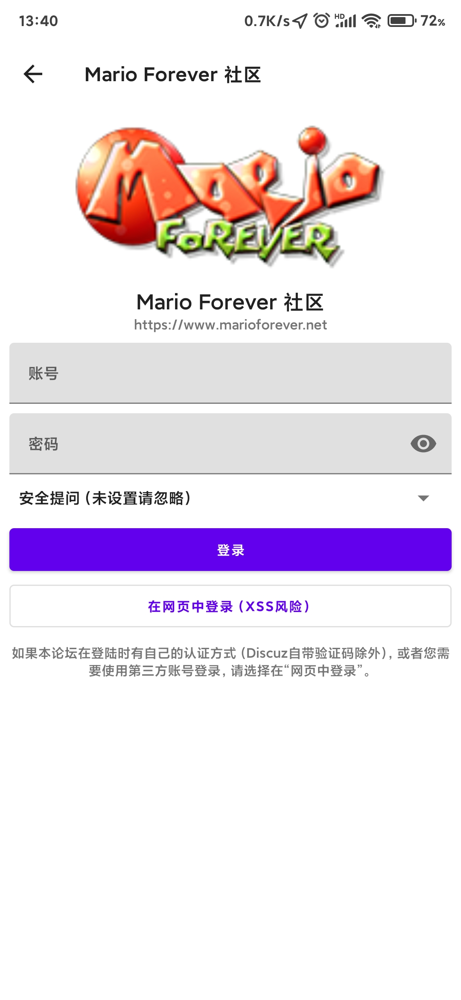
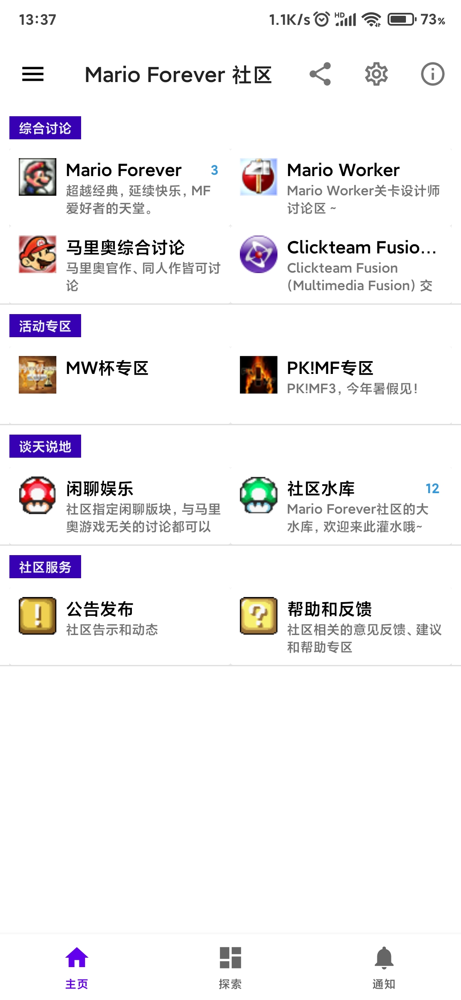
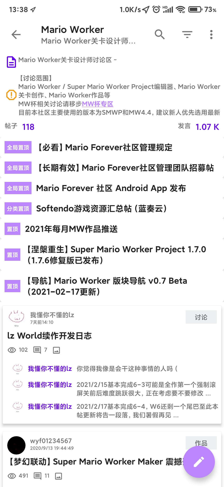
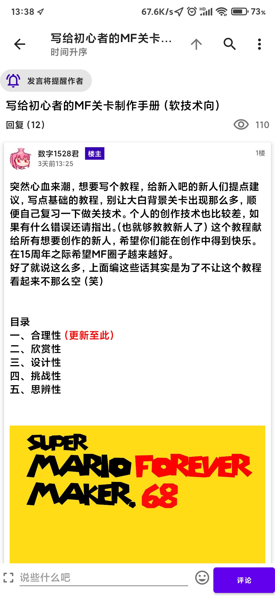
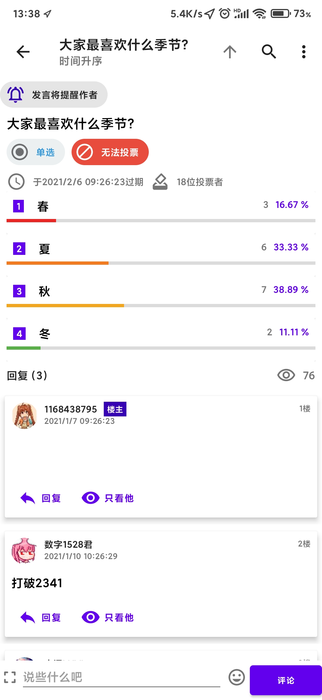

# Mario Forever 社区

Mario Forever 社区 Android 应用

本 App 基于 [Discuz Hub](https://github.com/kidozh/DiscuzHub)，在此对开发者表示感谢

社区 App 随上游同步更新，因此版本号和 Discuz Hub 是相同的（但包名不同）。

[发布地址](https://www.marioforever.net/thread-223-1-1.html)

[Dizcuz Hub 主页](https://discuzhub.kidozh.com/)

# 功能与支持

+ 应用层面
    - 支持密码以及网页验证
	- 支持 QQ 登录
    - 多账号支持
    - 深色模式支持
    - 通知预览
    - 新帖以及流行趋势展示
+ 论坛
    - 查阅版规、帖主
    - 以标签或者分类来过滤帖子
    - 查阅快速回复信息
+ 帖子
    - 浏览
    - 只看某个用户发的帖子
    - 时间排序
    - 快速回复
    - 给某位楼主回复
    - 富文本渲染支持
    - 内嵌的图像渲染支持（GIF 不支持播放）
    - 省流量模式
    - 查看图片并下载附件
+ 发帖
    - 支持类型和标签输入
    - 支持图片
    - 支持表情包（需要论坛指定）
    - 伪富文本支持
    - 草稿箱自动备份
    - 发帖失败自动备份内容
    - 富文本支持
    - 新增、删除以及修改草稿箱中的稿件内容
+ 通知
    - 系统推送
    - 帖子更新或者回复
    - 公共及私信查看及回复
+ 用户
    - 基本信息
    - 渲染 HTML 格式的个人信息
    - 查看好友以及他发表过的主题和帖子
    - 支持播放 GIF 动画头像
    - 内嵌 webview
    - 灵活的完成验证以及其他交互
    - 完整支持论坛网页渲染（可能会有 XSS 风险）
    
# 截图

## 登陆账号

## 选择分论坛

## 论坛内内容

## 展示帖子

## 投票

## 论坛消息和推送

# 开源协议

MIT 协议
